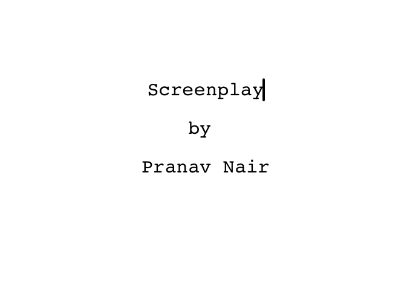

# Screenplay

A lightweight screenplay theme for Typora, following industry-standard format with automatic formatting and corrected scene numbering.

## Installation

1. [Download](https://github.com/pranavgn/Typora-Screenplay-Theme) the zipped project package from Github.
2. Copy the  `screenplay.css` file to your Typora theme library:
   * **Windows** : `%APPDATA%\Typora\themes`
   * **macOS** : `~/Library/Application Support/abnerworks.Typora/themes`
   * **Linux** : `~/.config/Typora/themes`
3. Launch or restart Typora and choose** ****Better Screenplay** from the Themes menu (Themes → Better Screenplay).

## Features

* **Industry-standard formatting** : Follows professional screenplay margins, spacing, and positioning.
* **Corrected Scene Numbering** : Scene numbers are correctly placed** ****outside** the right margin and above the heading (per industry standard).
* **Auto-formatting elements** : Parentheticals automatically include enclosing parentheses.
* **One-page-per-minute ratio** : Uses 12pt Courier Screenplay font for accurate timing.
* **Print-ready** : Exports clean PDFs with proper page breaks and formatting.
* **Title page support** : Blockquotes create centered title page elements with automatic page breaks.

## Formatting Guide

### Scene Headings (h1)

Create scene headings using a single  `#`. They will automatically:

* Convert to UPPERCASE and bold
* Be numbered on the right (outside the margin)
* Include proper spacing

**Markdown**

```
# INT. COFFEE SHOP - NIGHT
```

**Known Limitation:** Scene numbers only appear after you type at least one character into the heading. This is a limitation of how CSS counters work - they require actual text content to display. The scene number will appear as soon as you begin typing your scene heading.

### Action (Normal Text)

Write action descriptions as regular paragraphs (no markdown formatting needed). Action lines are left-aligned and describe what happens on screen.

**Markdown**

```
Cold rainy night; shop is dark, save for a light at a single table. JOHN RICK bursts into the shop, breaking down the doors, pistol in his hand.
```

### Character Names (h2)

Use  `##` for character names. They will automatically:

* Convert to UPPERCASE
* Position at 3.7 inches from the left margin

**Markdown**

```
## JOHN
```

### Dialogue (h3)

Use  `###` for dialogue lines immediately after a character name. Dialogue will:

* Position at 2.5 inches from the left margin
* Wrap at 6 inches from the left margin
* Maintain proper screenplay formatting

**Markdown**

```
### Give me back my dog and car! You fools!
```

### Parentheticals (h4)

Use  `####` for parentheticals (actor directions within dialogue). They will automatically:

* Add opening and closing parentheses
* Position at 3.1 inches from the left margin
* Appear in lowercase or as written

**Markdown**

```
#### shouting
```

### Transitions (h5)

Use  `#####` for transitions (CUT TO, FADE OUT, etc.). They will automatically:

* Convert to UPPERCASE
* Right-align on the page

**Markdown**

```
##### CUT TO:
```

### Title Page (Blockquotes)

Use blockquotes (`>`) to create title page elements. They will automatically:

* Center on the page
* Create a page break after the title page
* Format for standard screenplay title pages

**Markdown**

```
> **SCREENPLAY TITLE**
>
> Written by
>
> Your Name
```



### Page Breaks (Horizontal Rules)

Use  `---` to force a page break when needed.

**Markdown**

```
---
```

## Technical Specifications

* **Font** : Courier Screenplay (with Courier New and Courier as fallbacks)
* **Font Size** : 12pt
* **Page Size** : US Letter (8.5" × 11")
* **Margins** (Screen View) :
  * Left: 1.5 inches
  * Right: 1.25 inches (1 inch margin + allowance for scene number)
  * Top: 1 inch
  * Bottom: 1 inch
* **Character Name Position** : 3.7 inches from left edge
* **Dialogue Position** : 2.5 to 6 inches from left edge
* **Parenthetical Position** : 3.1 inches from left edge

## Credits

Created by Pranav Nair

v2.0 of the Screenplay Theme.

*Note: README and comments were enhanced using AI assistance.*
